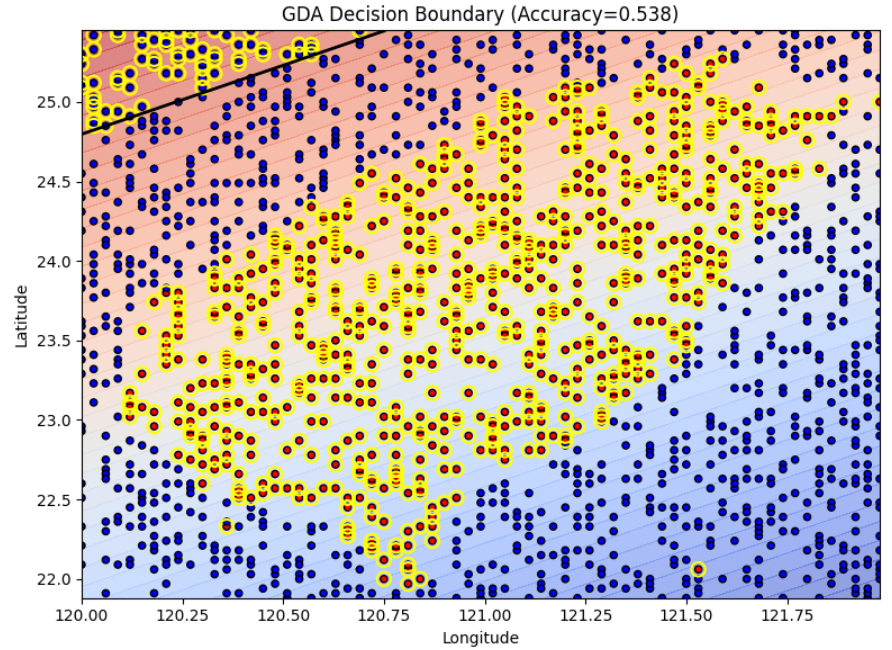
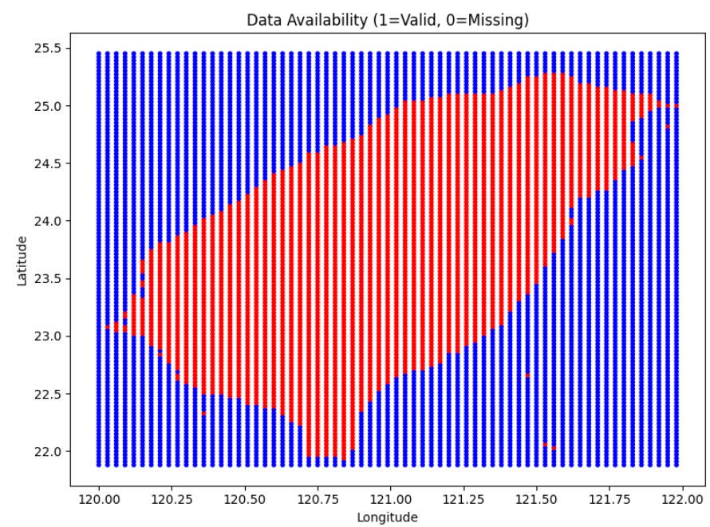
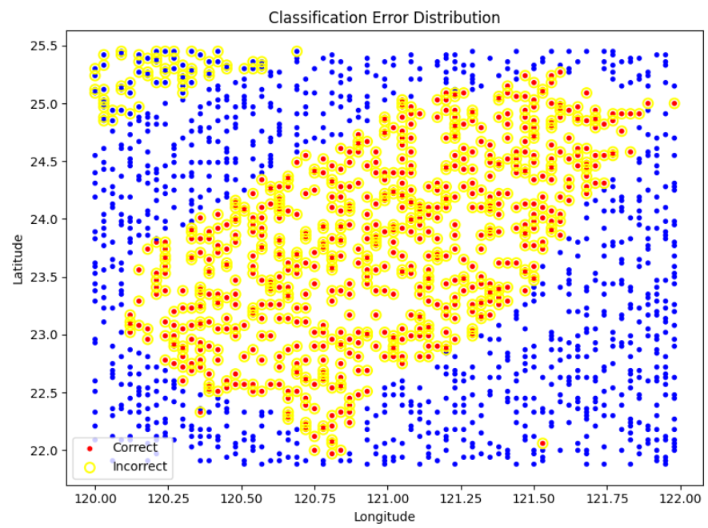
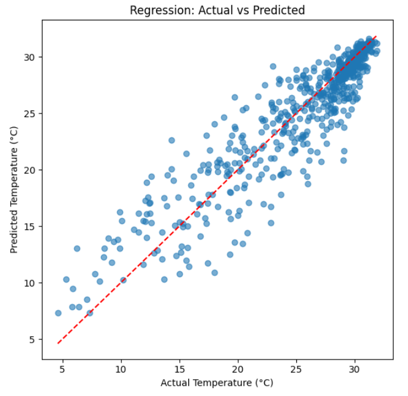

# Gaussian Discriminant Analysis on Temperature Data

## Ⅰ. Objective
Implement Gaussian Discriminant Analysis (GDA) from scratch (no built-in classifiers) to classify whether a grid point contains a valid temperature observation (label 1) or an invalid/missing value (label 0), using longitude and latitude as features.

## Ⅱ. Data Parsing & Datasets
**Source XML:** `O-A0038-003.xml` (中央氣象署格點資料)  
**Grid Resolution:** 0.03 degrees  

| Dataset | Rows | Description |
|---|---|---|
| Classification Dataset | 8040 | All grid points (valid + invalid) |
| Class 0 | 4545 (56.5%) | Missing/Invalid (−999.0) |
| Class 1 | 3495 (43.5%) | Valid Temperature |
| Regression Dataset | 3495 | Only valid temperature points |

## Ⅲ. GDA Implementation 
GDA assumes that the data points for each class follow a Gaussian distribution with a shared covariance matrix $$Σ$$.

* Compute Priors 

$$\phi = P(y = 1)$$

*  Compute Class Means 

$$\mu_0, \mu_1$$

* Compute Pooled Covariance

$$\Sigma = \frac{1}{n} \sum_{i=1}^{n} (x^{(i)} - \mu_{y^{(i)}})(x^{(i)} - \mu_{y^{(i)}})^T$$

* egularize $$Σ$$ slightly for numerical stability:  

$$\Sigma \leftarrow \Sigma + 10^{-6} I$$

* Decision Function for sample x
Log odds ratio:

$$
g(x) = \log\frac{\phi}{1-\phi} - \frac{1}{2}\left[(x-\mu_1)^T\Sigma^{-1}(x-\mu_1) - (x-\mu_0)^T\Sigma^{-1}(x-\mu_0)\right]
$$
 
Predict class 1 if $$g(x) > 0$$.

## Ⅳ. Training & Evaluation (GDA Classification)
* Features (X): Longitude, Latitude  
* Target (y): Label (0 or 1)  
* Train/Test Split: 80% train / 20% test   

* Confusion Matrix (CM) on Test Set

| Actual / Predicted | Predicted 0 | Predicted 1 |
|---|---|---|
| Actual 0 (TN+FP) | 864 (TN) | 45 (FP) |
| Actual 1 (FN+TP) | 699 (FN) | 0 (TP) |

* Classification Report(Total Test Samples: 1608 )

| Class | Precision | Recall | F1-score | Support |
|---|---|---|---|---|
| 0 | 0.55 | 0.95 | 0.70 | 909 |
| 1 | 0.00 | 0.00 | 0.00 | 699 |
| Accuracy |  |  | 0.54| 1608 |
| Macro avg| 0.28 | 0.47 | 0.35 | 1608 |
| Weighted avg| 0.31 | 0.54 | 0.39 | 1608 |

## Ⅴ. Error Analysis (Classification)

* False Positive Rate (FPR)

$$
\text{FPR} = \frac{FP}{FP + TN} = \frac{45}{909} \approx 0.0495
$$

*  False Negative Rate (FNR)

$$
\text{FNR} = \frac{FN}{FN + TP} = \frac{699}{699} = 1.0000
$$

* Discussion
The GDA model performed extremely poorly on the classification task, with a recall of 0.00 for Class 1 (valid data points), indicating that the model failed to correctly identify any actual valid data points.

Although the overall accuracy was approximately 54%, this was achieved entirely by highly correctly predicting Class 0 (missing points).
The results indicate that using only longitude and latitude, the GDA linear decision boundary is unable to effectively separate the two classes. This may be due to:
- Significant overlap in class distributions
- Data imbalance (a higher proportion of Class 0)

## Ⅵ. Random Forest Regression Analysis
For data points classified as Class 1 (valid), use **RandomForestRegressor** to predict temperature.

Model: RandomForestRegressor(n_estimators=100, random_state=42)
Features (Xᵣ): Longitude, Latitude  
Target (yᵣ): Valid Temperature values  

* Regression Error Metrics

| Metric | Notes |
|---|---|
| Mean Squared Error (MSE) |  Measures the average squared error between the predicted and actual values. |
| R-squared (R²) | Measures the model's ability to explain the variability in the dependent variable (1.0 is a perfect fit). |

## Ⅶ. Visualizations

* GDA 決策邊界與測試點分佈圖  
* 原始資料點 (有效/缺失) 的地理分佈圖  
* GDA 分類錯誤點的地理分佈圖  
* 隨機森林回歸模型的實際溫度與預測溫度散點圖  

---
### Programing
* link:https://colab.research.google.com/drive/11hjJhkN8YmsCguKLLiz46AxMXSEKz0Ay?usp=sharing
