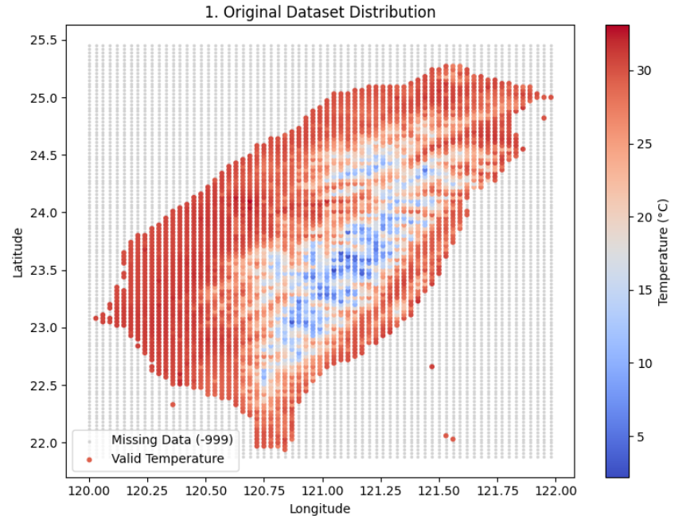

## Piecewise Regression using GDA + Random Forest

## Ⅰ. Definition

This assignment is to build a regression model that represents a piecewise smooth function.  
This time we are going to combine the two regression models into a function.

$$
h(\vec{x}) =
\begin{cases}R(\vec{x}), & \text{if } C(\vec{x}) = 1 \\
-999, & \text{if } C(\vec{x}) = 0\end{cases}
$$

Where:
-  $$C(\vec{x})$$: $$Classification$$ $$model$$ $$(GDA)$$
-  $$R(\vec{x})$$: $$Regression$$ $$model$$
-  $$h(\vec{x})$$: $$Piecewise$$ $$regression$$ $$output$$

---

## Ⅱ. Implementation

**Model Components**

- Classification model: Gaussian Discriminant Analysis
  - Determines whether a data point belongs to a valid region (`C(x)=1`) or a missing data zone (`C(x)=0`).

- Regression model: Random Forest Regressor  
  - Predicts the temperature value only within valid regions.

- Piecewise model:
  ```python
  def h_model(X):
      c_pred = gda.predict(X)
      r_pred = reg.predict(X)
      return np.where(c_pred == 1, r_pred, -999)
  ```

---

## Ⅲ. Dataset(upload & analysis)

The XML file (`O-A0038-003.xml`) contains spatial temperature grid data with geographic coordinates:

| Field | Description |
|--------|--------------|
| Longitude | X-coordinate of location |
| Latitude | Y-coordinate of location |
| Temperature | Temperature value (°C), -999 indicates missing data |
  ```python
print("請上傳XML檔案")
uploaded = files.upload()

xml_path = list(uploaded.keys())[0]
print(f"已上傳檔案：{xml_path}")


out_dir = "./piecewise_results"
os.makedirs(out_dir, exist_ok=True)


def parse_temperature_data(xml_path):
    with open(xml_path, "r", encoding="utf-8") as f:
        xml_content = f.read()
    root = ET.fromstring(xml_content)

    def find_text(node, tag):
        el = node.find('.//{*}' + tag)
        return el.text if el is not None else None

    geo = root.find('.//{*}GeoInfo')
    bottom_left_lon = float(find_text(geo, "BottomLeftLongitude"))
    bottom_left_lat = float(find_text(geo, "BottomLeftLatitude"))
    top_right_lon = float(find_text(geo, "TopRightLongitude"))
    top_right_lat = float(find_text(geo, "TopRightLatitude"))

    content_el = root.find('.//{*}Content')
    content = content_el.text.strip()
    grid_data = np.array([[float(x) for x in line.split(',')] for line in content.splitlines()])
    return grid_data, bottom_left_lon, bottom_left_lat, top_right_lon, top_right_lat
  ```
The XML was parsed into two datasets:
- Classification dataset: includes all points with label = 0 or 1  
- Regression dataset: includes only valid temperature values

---


## Ⅳ. Results

After applying the combined model on the test set:

| Metric | Result |
|--------|---------|
| GDA Accuracy | Example: $$0.96$$ |
| Valid Predictions (C(x)=1) | Example: $$1840 / 2000$$ points |

The model successfully predicts temperature values for valid regions while assigning $$-999$$ to missing zones.

---

## Ⅴ. Visualization

A scatter plot of predicted results was generated:

- Color: Represents temperature or -999 (invalid region)  
- Axes: Longitude (x) vs Latitude (y)

  ```python
  def main():
    grid_data, bl_lon, bl_lat, tr_lon, tr_lat = parse_temperature_data(xml_path)
    classification_df, regression_df = create_datasets(grid_data, bl_lon, bl_lat)
    X = classification_df[["longitude", "latitude"]].values
    y = classification_df["label"].values.astype(int)

    X_train, X_test, y_train, y_test = train_test_split(X, y, test_size=0.2, random_state=42)

    gda = GDA(regularize=1e-6)
    gda.fit(X_train, y_train)
    y_pred_class = gda.predict(X_test)

    Xr = regression_df[["longitude", "latitude"]].values
    yr = regression_df["temperature"].values
    reg = RandomForestRegressor(n_estimators=100, random_state=42)
    reg.fit(Xr, yr)

    def h_model(X):
        c_pred = gda.predict(X)
        r_pred = reg.predict(X)
        return np.where(c_pred == 1, r_pred, -999)

    h_pred = h_model(X_test)


    valid_pred = h_pred[h_pred != -999]
    acc_class = accuracy_score(y_test, y_pred_class)
    print(f"\n=== Piecewise Model Results ===")
    print(f"GDA Accuracy: {acc_class:.4f}")
    print(f"Predicted valid points: {len(valid_pred)} / {len(h_pred)}")


    plt.figure(figsize=(8, 6))
    sc = plt.scatter(X_test[:, 0], X_test[:, 1], c=h_pred, cmap="coolwarm", s=10)
    plt.colorbar(sc, label="Predicted Temperature or -999")
    plt.xlabel("Longitude")
    plt.ylabel("Latitude")
    plt.title("Piecewise Regression Output $h(\\vec{x})$")
    plt.tight_layout()
    plt.savefig(f"{out_dir}/piecewise_output.png", dpi=150)
    plt.show()
  ```


The above indeed demonstrates that the segment definition occurs as expected—the temperature gradient is smooth in the valid region of the dataset, while the missing region at -999 is flat.

---


## Ⅵ. Conclusion

This assignment demonstrates the integration of classification and regression into a unified spatial prediction model.  
By combining GDA and Random Forest, we achieved a robust piecewise regression that:
- Smoothly predicts temperature across valid zones.
- Distinguishes missing data regions automatically.

---
