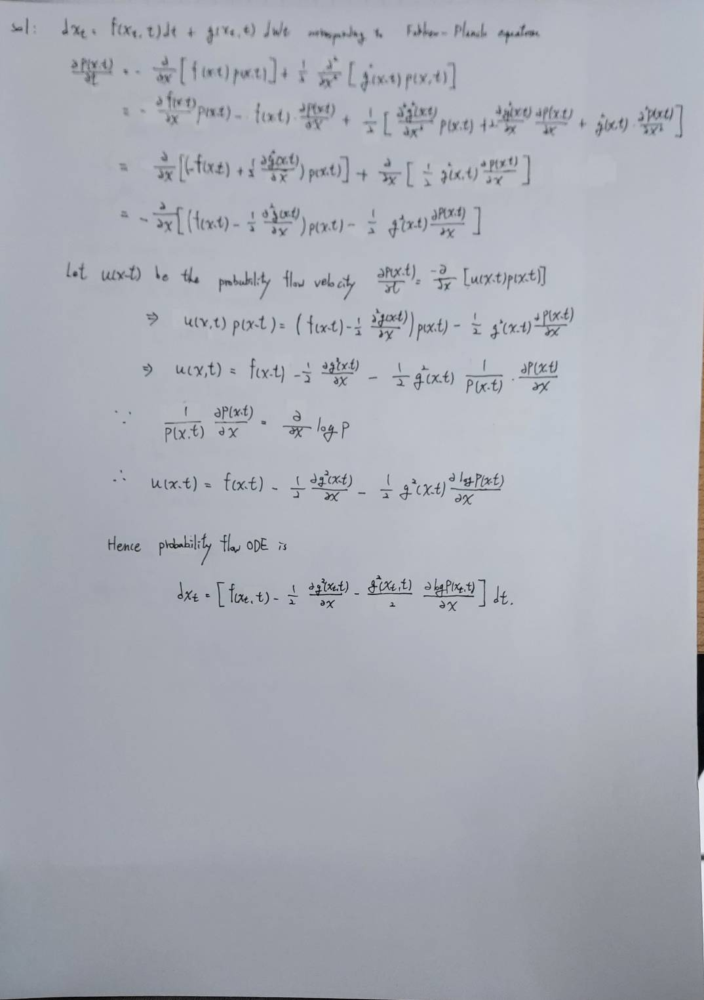

Consider a forward SDE

$$dx_t = f(x_t, t)\,dt + g(x_t, t)dW_t,$$

show that the corresponding probability flow ODE is written as

$$dx_t = \left[f(x_t,t) -\frac{1}{2}\frac{\partial}{\partial x}g^2(x_t, t)- \frac{g^2(x_t,t)}{2}\frac{\partial}{\partial x}\log p(x_t,t)\right]\,dt.$$

