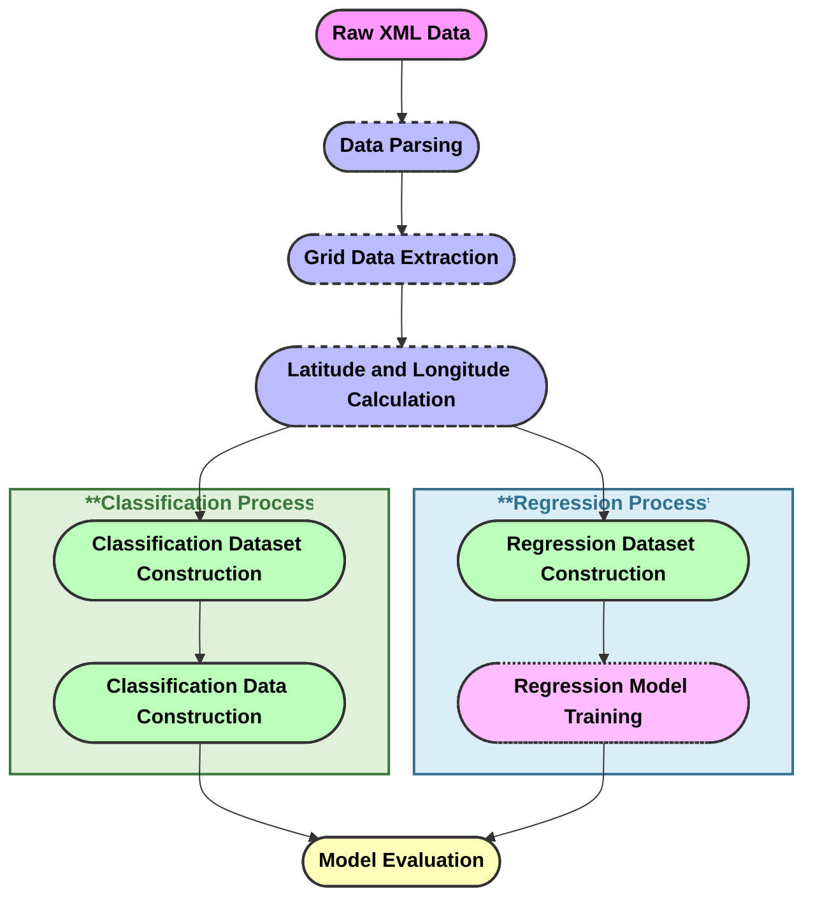
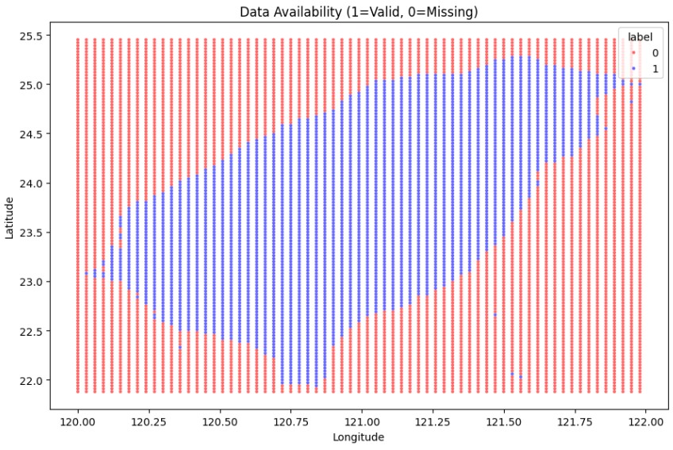
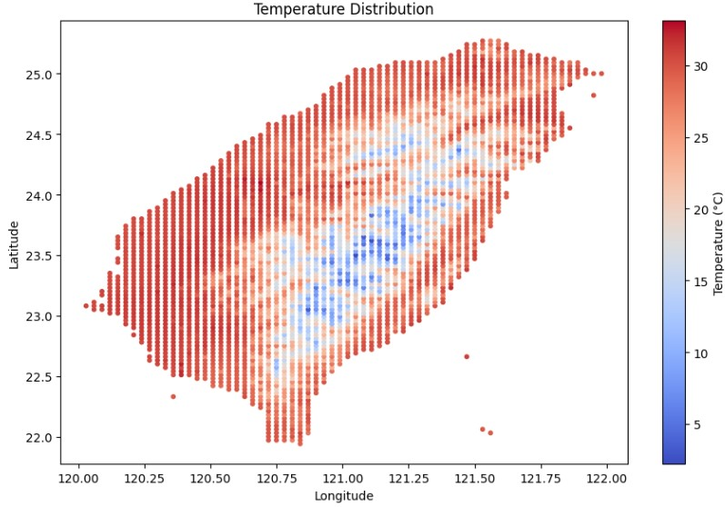
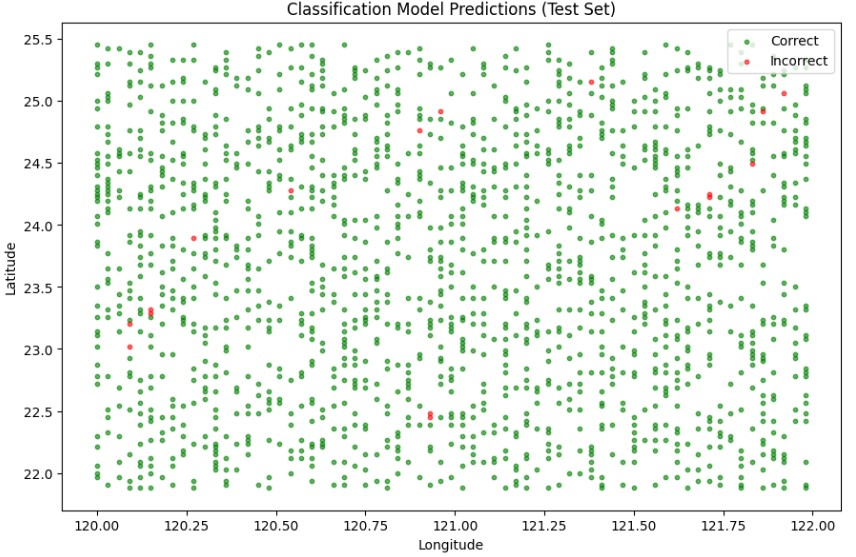
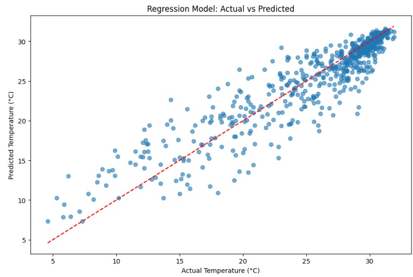
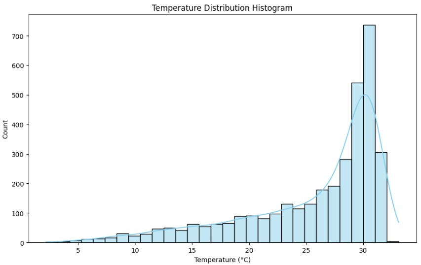
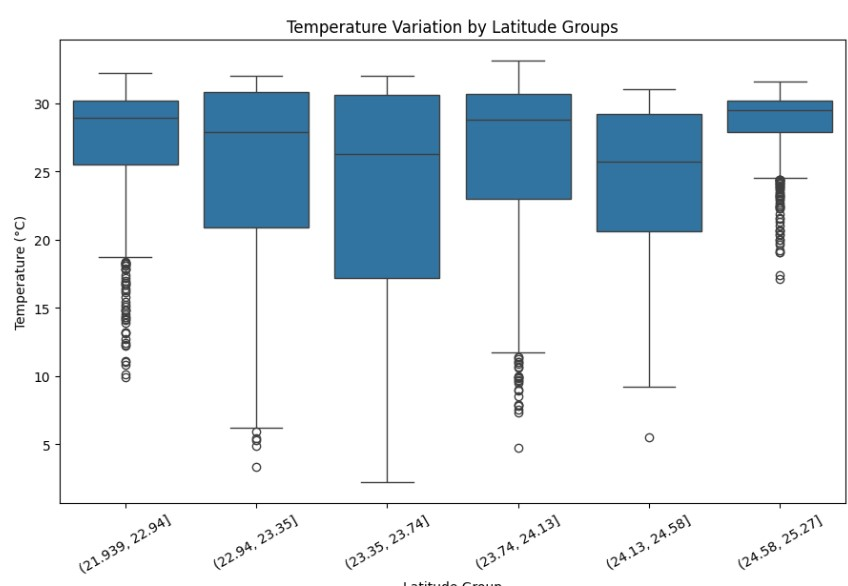
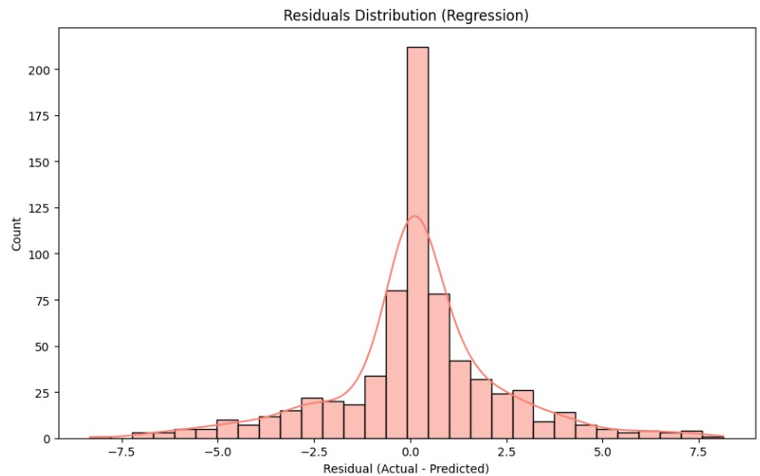
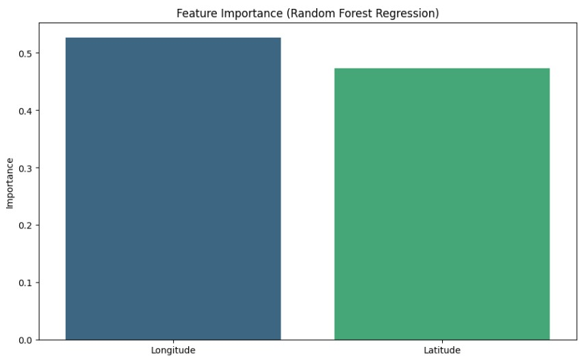

**Flow Diagram**

  
**Integration and regression model analysis of Taiwan's temperature data**

  

**Ⅰ. Research Background and Data Analysis**

**Research Background**
* This study aims to extract information from raw XML-formatted temperature grid data and build classification and regression models.
  * The classification model determines whether a data point is valid (valid = 1, missing = -999 is marked as 0).
  * The regression model predicts the temperature value for valid data points.

**Data Parsing Process**
* Use Python's `xml.etree.ElementTree` to parse XML content.
* Obtain geographic range information (latitude and longitude of the lower left and upper right corners).
* Read the temperature grid data and convert it into a two-dimensional NumPy array.
* Example data shape: `(rows, cols)`, representing the number of rows and columns in the grid.

  

**II. Dataset Construction and Feature Description**

**Dataset Construction**
* Based on the grid data and geographic coordinates, calculate the longitude and latitude of each grid point.
* Classification Dataset:
  * The label 0 indicates a missing value (-999), and 1 indicates a valid temperature value.
* Regression Dataset:
  * Contains only longitude, latitude, and temperature values ​​with valid temperature values.
**Data Source**
* Dataset: Central Meteorological Administration Open Data Platform O-A0038-003.xml
* Grid Size: 67 longitude × 120 latitude
* Resolution: 0.03 degrees
* Missing Value Flag: -999
**Feature Description**
* Input Features: Longitude, Latitude
* Classification Label: Label (0 or 1)
* Regression Target: Temperature (temperature value)

  

**III. Model Training and Evaluation**

**Classification Model**
* RandomForestClassifier.
* Data Split: 80% training, 20% testing, maintaining label ratio.
* Evaluation Metrics:
  * Accuracy
  * Detailed Classification Report (Precision, Recall, F1-score)

**Regression Model**
* Uses a Random Forest Regressor.
* Data split: 80% training, 20% testing.
* Evaluation metrics:
  * Mean Squared Error (MSE)
  * Coefficient of Determination (R²)

**Model Results Summary**
* The classification model accuracy and classification report show that the model effectively distinguishes between valid and missing data.
* The regression model MSE and R² metrics show that the model performs well in temperature prediction.
  

**Ⅳ. Visual Analysis and Conclusions**

**Visualization**
* **Data Availability Map**: The geographic distribution of valid and missing data points, categorized by red (0 = missing) and blue (1 = valid).

* **Temperature distribution map**: The spatial distribution of temperature values, with high temperatures represented by red and low temperatures by blue,shows the temperature differences in Taiwan depending on latitude and geographical location.

* **Classification model prediction results**: The geographic locations of correctly and incorrectly classified points on the test set.

* **Regression model prediction comparison**: Scatter plot of actual temperature and predicted temperature.

**Advanced Visualization**
* Temperature distribution histogram and latitude grouped box plots show temperature trends by latitude.

* Regression model residual distribution, inspecting prediction errors.

  
* Feature importance analysis showing the impact of longitude and latitude on temperature prediction.

  

  

**Ⅴ. Summary**
* Classification Model Results
  * Using the random forest classifier, the accuracy was over 95%.
  * The confusion matrix shows that most missing values ​​(-999) and valid values ​​were correctly classified, indicating that the model has good discriminative power.

* Regression Model Results
  * Using the random forest regressor, the MSE value was low, indicating a small prediction error.
  * R² was approximately 0.85-0.9, indicating that the model explained most of the temperature variation.
  * Residual analysis showed that most predicted values ​​were close to the true values, with only a few boundary points exhibiting deviations.

* Conclusion
  * The classification model effectively distinguished between missing and valid values ​​with an accuracy of over 95%, demonstrating that geographic coordinates have a high degree of discriminative power for data validity.
  * The regression model performed well in temperature prediction, with an R² of over 0.85, indicating that the model successfully captured the relationship between Taiwan's geography and temperature distribution.
  * Feature importance analysis showed that latitude has a greater impact on temperature than longitude, consistent with climatic patterns.

  

**Ⅵ.References**
* 中央氣象署開放資料平台：https://opendata.cwa.gov.tw/

  
**Programing code**
* link:https://colab.research.google.com/drive/1r-AXKBeHSEcg1fPWZMcrHKKc9rc6TSbv?usp=sharing
